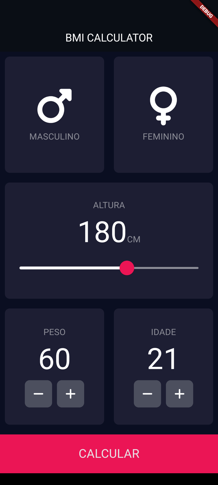
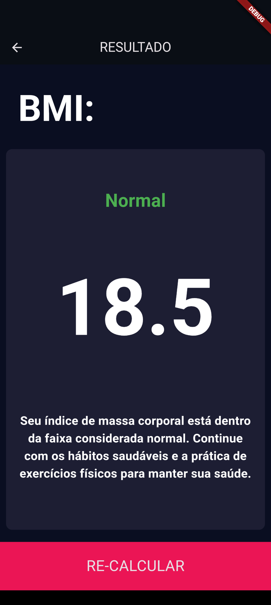

# Calculadora de Índice de Massa Corporal - Projeto Flutter

Este projeto consiste em uma aplicação simples desenvolvida em Flutter, que calcula o Índice de Massa Corporal (IMC) com base no peso e na altura fornecidos pelo usuário.

## Capturas de tela

## Alguns Recursos e Widgets Utilizados
- **Scaffold**: Widget utilizado para criar a estrutura básica da aplicação.
- **AppBar**: Widget para exibir a barra superior com o título do aplicativo.
- **Column**: Widget utilizado para organizar os elementos verticalmente.
- **TextFormField**: Widget para entrada de texto, usado para capturar o peso e a altura do usuário.
- **ElevatedButton**: Widget de botão que responde ao toque do usuário para calcular o IMC.
- **Text**: Widget para exibir o resultado do cálculo do IMC.
- **StatefulWidget**: Classe base para widgets que têm estado mutável.
- **StatelessWidget**: Classe base para widgets que têm estado imutável.
- **Row**: Widget utilizado para organizar os elementos horizontalmente.
- **Container**: Widget utilizado para criar caixas retangulares com capacidade de estilização.
- **Icon**: Widget para exibir ícones na interface do usuário.
- **GestureDetector**: Widget utilizado para detectar gestos do usuário, como toques, arrastos e gestos de rolagem.
- **Expanded**: Widget utilizado dentro de uma linha ou coluna para expandir seu filho para preencher o espaço disponível.

## Classes do Projeto
- **Constants**: Contém todas as constantes utilizadas no projeto.
- **IconContent**: Widget responsável por criar os ícones masculino e feminino junto com seus respectivos nomes.
- **CustomCard**: Classe para criar cards customizados utilizados na interface do aplicativo.
- **InputPage**: Classe que monta a estrutura principal do aplicativo.
- **ResultScreen**: Tela de resultados.
- **main**: Classe responsável por inicializar o aplicativo Flutter.
- **MainScreen**: Tela inicial.
- **BottomButton**: Classe para criação do botão na parte de baixo do aplicativo.
- **IconButton**: Classe que cria os botões de decrementar e incrementar.
- **CalculatorBrain**: Classe que faz os cálculos de BMI.

## Como Executar
1. Certifique-se de ter o ambiente de desenvolvimento Flutter configurado corretamente em seu sistema.
2. Clone este repositório.
3. Abra o projeto em seu editor de código preferido.
4. Execute `flutter pub get` para instalar as dependências.
5. Conecte um dispositivo ou inicie um emulador.
6. Execute `flutter run` para iniciar o aplicativo.

## Autor
Lucas Muner Garcia
